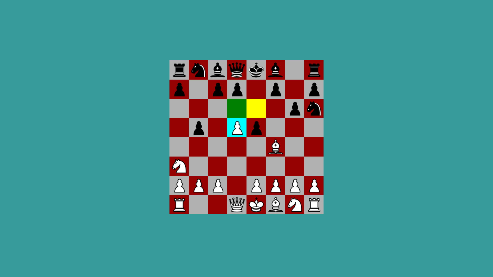

<div id="top"></div>
<!-- PROJECT LOGO -->
<br />
<div align="center">

<h3 align="center">ChessJs</h3>

  <p align="center">
    A chess game written with TypeScript and React
    <br />
    <br />
    <br />
    <a href="https://github.com/THashimov/ChessJs/issues">Report Bug</a>
    ·
    <a href="https://github.com/THashimov/ChessJs/issues">Request Feature</a>
  </p>
</div>


<!-- TABLE OF CONTENTS -->
<details>
  <summary>Table of Contents</summary>
  <ol>
    <li>
      <a href="#about-the-project">About The Project</a>
      <ul>
        <li><a href="#built-with">Built With</a></li>
      </ul>
    </li>
    <li>
      <a href="#getting-started">Getting Started</a>
      <ul>
        <li><a href="#installation">Installation</a></li>
      </ul>
    </li>
    <li><a href="#roadmap">Roadmap</a></li>
    <li><a href="#contributing">Contributing</a></li>
    <li><a href="#license">License</a></li>
  </ol>
</details>


<!-- ABOUT THE PROJECT -->
## About The Project

Another chess game written with TypeScript and React. I am building this to practice multi-dimensional arrays and implementing algorithms.



<p align="right">(<a href="#top">back to top</a>)</p>

### Built With

* [React](https://reactjs.org/)

<p align="right">(<a href="#top">back to top</a>)</p>

<!-- GETTING STARTED -->
## Getting Started

There are a few dependancies so you will need npm installed

### Installation

1. Clone the repo
   ```sh
   git clone git@github.com:THashimov/ChessJs.git
   ```
2. Run with npm
   ```sh
   npm start
   ```
<p align="right">(<a href="#top">back to top</a>)</p>

<!-- ROADMAP -->
## Roadmap

- [X] Alternate turns
- [X] Only valid moves shown
- [X] En passant
- [ ] 50 move rule
- [ ] Three fold repetition
- [ ] Castling
- [ ] Pawn promotion
- [ ] Play online against other people
- [ ] Play against the computer
- [ ] Difficulty setting


See the [open issues](https://github.com/THashimov/ChessJs/issues) for a full list of proposed features (and known issues).

<p align="right">(<a href="#top">back to top</a>)</p>

<!-- CONTRIBUTING -->
## Contributing

Contributions are what make the open source community such an amazing place to learn, inspire, and create. Any contributions you make are **greatly appreciated**.

If you have a suggestion that would make this better, please fork the repo and create a pull request. You can also simply open an issue with the tag "enhancement".
Don't forget to give the project a star! Thanks again!

1. Fork the Project
2. Create your Feature Branch (`git checkout -b feature/AmazingFeature`)
3. Commit your Changes (`git commit -m 'Add some AmazingFeature'`)
4. Push to the Branch (`git push origin feature/AmazingFeature`)
5. Open a Pull Request

<p align="right">(<a href="#top">back to top</a>)</p>

<!-- LICENSE -->
## License

Distributed under the MIT License. See `LICENSE.txt` for more information.

<p align="right">(<a href="#top">back to top</a>)</p>

<p align="right">(<a href="#top">back to top</a>)</p>


<!-- MARKDOWN LINKS & IMAGES -->
<!-- https://www.markdownguide.org/basic-syntax/#reference-style-links -->
[contributors-shield]: https://img.shields.io/github/contributors/github_username/repo_name.svg?style=for-the-badge
[contributors-url]: https://github.com/THashimov/ChessJs/graphs/contributors
[forks-shield]: https://img.shields.io/github/forks/github_username/repo_name.svg?style=for-the-badge
[forks-url]: https://github.com/THashimov/ChessJs/network/members
[issues-shield]: https://img.shields.io/github/issues/github_username/repo_name.svg?style=for-the-badge
[issues-url]: https://github.com/THashimov/ChessJs/issues
[license-shield]: https://img.shields.io/github/license/github_username/repo_name.svg?style=for-the-badge
[license-url]: https://github.com/THashimov/ChessJs/blob/main/LICENSE.txt
